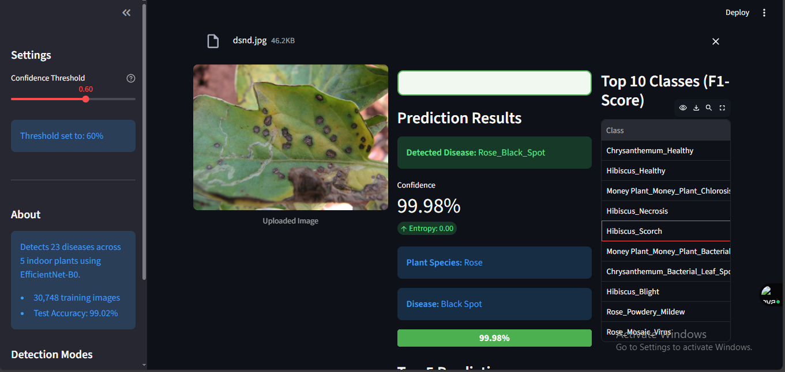
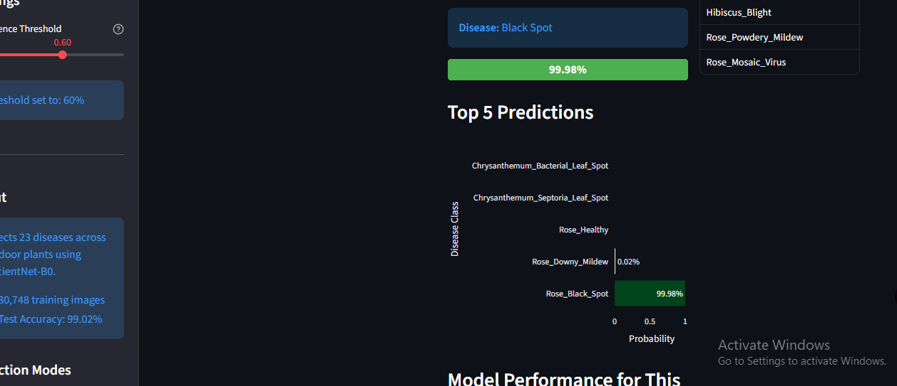
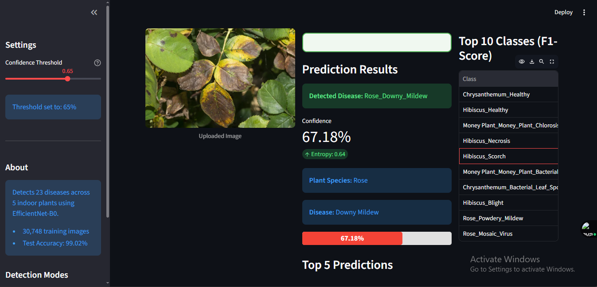

# Deep Learning-Based Indoor Plant Disease Detection: A Mobile Application Framework for Urban Environments

## Overview
 This project presents a comprehensive, high-accuracy solution for detecting diseases in indoor plants using advanced Deep Learning techniques.  The system is specifically designed to address the challenges of plant health monitoring in urban environments, offering a seamless, real-time diagnostic tool via a dedicated Android mobile application and a robust REST API.

### Key Features
*  **High-Accuracy Diagnosis:** Achieved an exceptional **97.51% accuracy** in disease identification using the optimized MobileNetV2 architecture.
*  **Real-Time Prediction:** Integrates the trained model via a **Flask** REST API for fast, on-demand predictions.
*  **Mobile-First Approach:** Developed a user-friendly **Android Application Flutter** that allows users to capture or upload images for instant diagnosis on their device.
*  **Comprehensive Study:** Conducted a comparative analysis of three state-of-the-art Convolutional Neural Network (CNN) models: **MobileNetV2, ResNet-50, and EfficientNet-B0**

## System Architecture

The system follows a three-tier architecture ensuring scalable deployment and efficient mobile integration:

1.  **Mobile Client:** The Android application captures/uploads an image and sends it to the API.
2.  **Prediction Server:** The Flask API receives the image, preprocesses it, and performs inference using the saved Keras model.
3.  **Model/Data:** The Efficient BO model handles the classification task.

## Team

*  Eileen Mascarenhas 
*  Aditi Salvi 
*  Vedant Vaidya

---
 *This project as part of the Major Project for the Master of Computer Application degree at Sardar Patel Institute of Technology, 2025-2026.*
